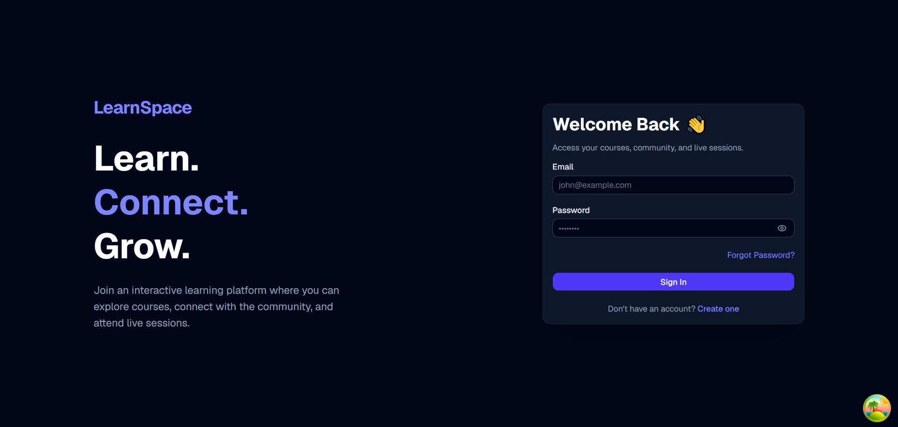
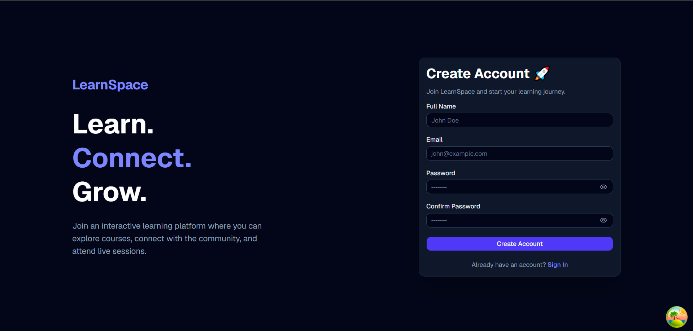
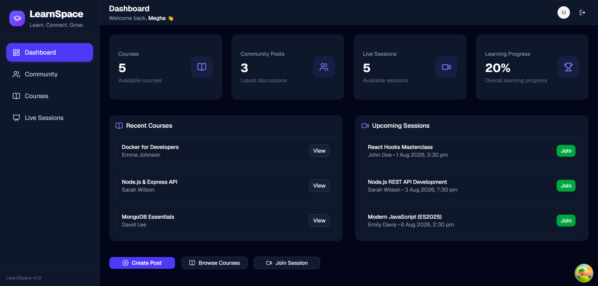
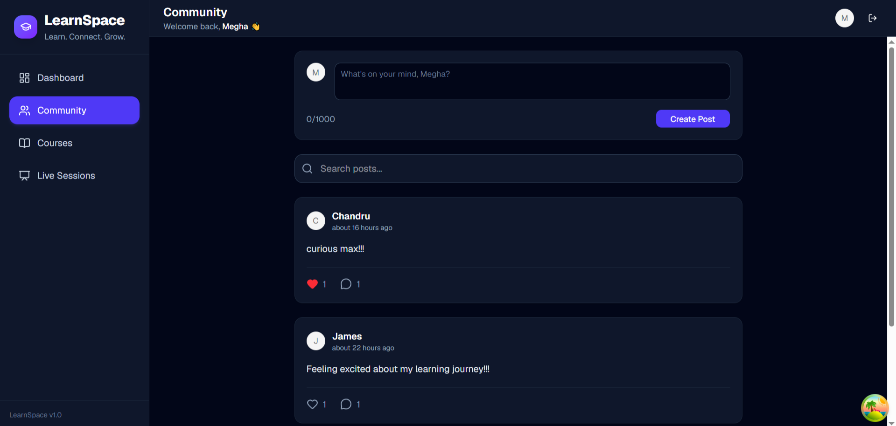
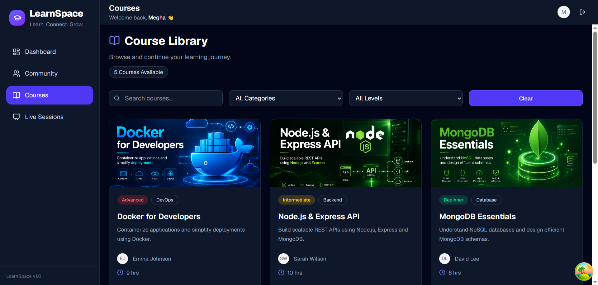
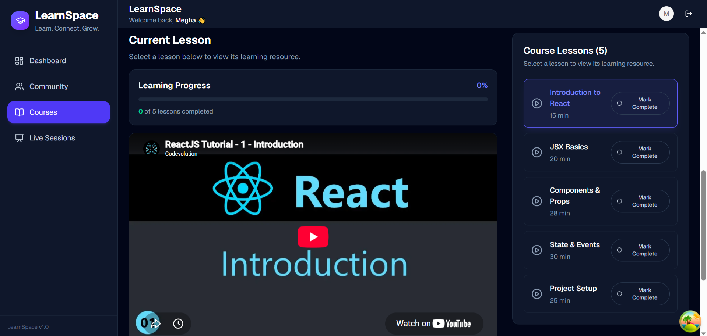
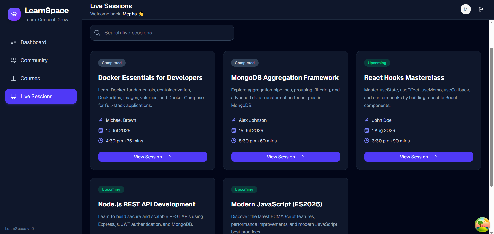
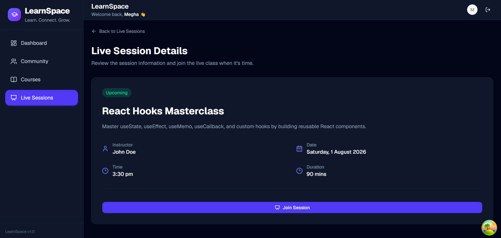

# 🎓 LearnSpace

> A modern full-stack Course Learning Platform built with the MERN Stack, featuring community discussions, video-based courses, and live learning sessions.


---

## 📑 Table of Contents

- [Overview](#-overview)
- [Features](#-features)
- [Tech Stack](#-tech-stack)
- [Project Architecture](#-project-architecture)
- [Project Structure](#-project-structure)
- [Getting Started](#-getting-started)
- [API Endpoints](#-api-endpoints)
- [Documentation](#-documentation)
- [Future Improvements](#-future-improvements)
- [Author](#-author)

## 📖 Overview

LearnSpace is a modern full-stack Learning Management System (LMS) built with the MERN stack. The platform enables users to browse courses, watch recorded video lessons, engage in community discussions, and join upcoming live learning sessions.

This project was developed as part of a Full Stack Developer interview assignment, emphasizing clean architecture, reusable components, responsive UI, and scalable backend design.

---

## 🌐 Live Demo

- 🚀 **Frontend:** https://learn-space-psi.vercel.app
- 🔗 **Backend API:** https://learn-space.onrender.com

---

## ✨ Features

### 👤 Authentication

- Secure JWT Authentication
- Login & Logout
- Protected Routes

---

### 💬 Community Feed

- Create Posts
- Like Posts
- Comment on Posts
- Latest First Feed
- Form Validation

---

### 📚 Courses

- Browse Courses
- Search Courses
- Filter by Category
- Filter by Level
- Course Details
- Embedded Video Lessons
- Lesson Progress Tracking
- Course Completion Progress

---

### 🎥 Live Sessions

- Browse Upcoming Sessions
- Search Sessions
- Session Details
- Join Meeting Link

---

### 📊 Dashboard

- Learning Statistics
- Recent Courses
- Upcoming Sessions
- Quick Actions

---

## 🛠 Tech Stack

### Frontend

- React
- React Router
- React Query (TanStack Query)
- Axios
- Tailwind CSS
- shadcn/ui
- Lucide React

### Backend

- Node.js
- Express.js
- MongoDB Atlas
- Mongoose
- JWT Authentication

### Development Tools

- Git
- GitHub
- Vite
- Postman

---

## 🏛 Project Architecture

The application follows a modular MERN architecture.

```
React Client
      │
 REST API
      │
Express Server
      │
 MongoDB Atlas
```

📄 Detailed architecture documentation is available in:

**[ARCHITECTURE.md](./ARCHITECTURE.md)**

---

## 📁 Project Structure

```
LearnSpace
│
├── client
│   ├── public
│   ├── src
│   │   ├── api
│   │   ├── assets
│   │   ├── components
│   │   ├── hooks
│   │   ├── layouts
│   │   ├── lib
│   │   ├── pages
│   │   ├── providers
│   │   ├── routes
│   │   ├── schemas
│   │   ├── services
│   │   ├── utils
│   │   ├── App.jsx
│   │   └── main.jsx
│   │
│   ├── package.json
│   └── vite.config.js
│
├── server
│   ├── public
│   ├── src
│   │   ├── config
│   │   ├── controllers
│   │   ├── middleware
│   │   ├── models
│   │   ├── routes
│   │   ├── seed
│   │   ├── services
│   │   ├── utils
│   │   ├── validators
│   │   └── app.js
│   │
│   ├── package.json
│   └── server.js
│
├── README.md
└── ARCHITECTURE.md
```

---

## 🚀 Getting Started

### Clone Repository

```bash
git clone https://github.com/yourusername/learnspace.git
```

```
cd learnspace
```

---

### Install Dependencies

#### Client

```bash
cd client
npm install
```

#### Server

```bash
cd server
npm install
```

---

## ⚙ Environment Variables

Create a `.env` file inside the `server` folder.

```env
PORT=5000

MONGO_URI=your_mongodb_connection_string

JWT_SECRET=your_secret_key
```

---

## ▶ Running the Application

### Backend

```bash
cd server
npm run dev
```

### Frontend

```bash
cd client
npm run dev
```

---

## 📡 API Endpoints

### Authentication

```
POST /api/auth/login
POST /api/auth/register
GET  /api/auth/profile
```

### Community

```
GET    /api/posts
POST   /api/posts
PUT    /api/posts/:id/like
POST   /api/posts/:id/comments
```

### Courses

```
GET /api/courses
GET /api/courses/:id
```

### Live Sessions

```
GET /api/live-sessions
GET /api/live-sessions/:id
GET /api/live-sessions/upcoming
```

---

## 🎨 UI Highlights

- Modern Dashboard
- Responsive Layout
- Clean Navigation
- Embedded YouTube Video Lessons
- Interactive Community Feed
- Learning Progress Tracking

---

## 📸 Screenshots

### 🔐 Login


---

### 🚀 Register


---

### 📊 Dashboard


---

### 👥 Community Feed


---

### 📚 Course Library


---

### 🎥 Course Details


---

### 📅 Live Session Page


---

### 📅 Live Session Details


---

## 🔮 Future Improvements

- Role-Based Access Control
- Course Enrollment
- Real-time Notifications
- Live Video Streaming
- File Uploads
- Certificates
- Dark Mode
- Pagination
- Advanced Search

---

## 🤝 Design Decisions

- Feature-based folder structure
- RESTful API architecture
- React Query for server state management
- JWT Authentication
- Modular backend architecture
- Reusable UI components
- Embedded YouTube lessons instead of hosting videos

---

## 👨‍💻 Author

**Chandra Prakash**

GitHub:
https://github.com/Chandra-Prakash-S

LinkedIn:
https://www.linkedin.com/in/chandra-prakash-it/

---

## 📄 License

This project is created for educational and interview evaluation purposes.
